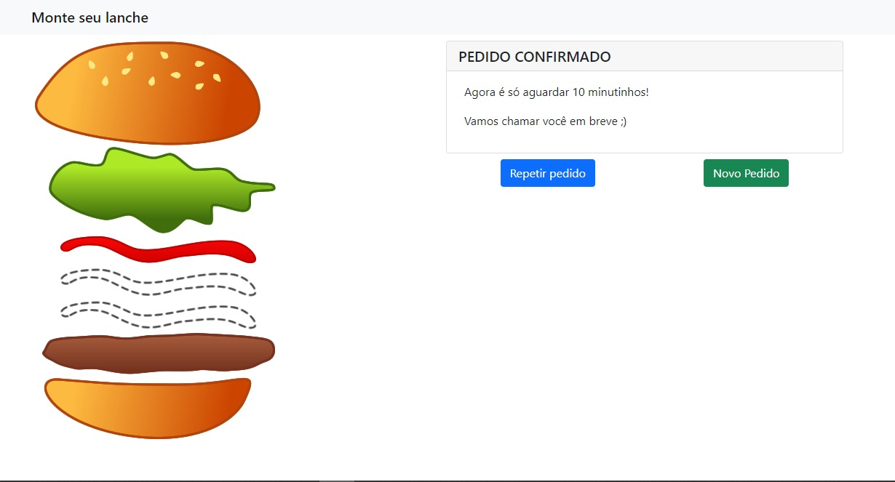

<h1 align="center">
  Montando o lanche
</h1>

<p align="center">
  <a href="#-projeto">Projeto</a>&nbsp;&nbsp;&nbsp;|&nbsp;&nbsp;&nbsp;
  <a href="#-tecnologias-utilizadas">Tecnologias Utilizadas</a>&nbsp;&nbsp;&nbsp;|&nbsp;&nbsp;&nbsp;
  <a href="#-como-executar">Como executar</a>&nbsp;&nbsp;&nbsp;|&nbsp;&nbsp;&nbsp;
  <a href="#-licença">Licença</a>
</p>

<br>

<p align="center">
  
  
</p>

## 💻 Projeto

O app Montando Lanche trata-se de apenas de um projeto de estudos do básico do VueJs.


## ✨ Tecnologias utilizadas

Esse projeto foi desenvolvido com as seguintes tecnologias:

- [VueJs](https://vuejs.org/)
- [JavaScript](https://www.javascript.com/)
- [Bootstrap](https://getbootstrap.com/)

## 🚀 Como executar

- Utilize o live server.

**Clone o projeto**

```bash
  git clone https://github.com/kaicLimaOliveira/MontandoLanche.git
```

---

<a href="https://kaicLimaOliveira.github.io">
 
 <br />
 <sub><b>Kaic de Lima Oliveira</b></sub></a>

Feito por Kaic de Lima Oliveira 👋🏽 Entre em contato!

[](https://www.facebook.com/kaic.oliveira.587) [](https://www.instagram.com/kaic.lo)
[](mailto:kaic10@outlook.com)
[](https://www.linkedin.com/in/kaic-de-lima-oliveira-3633041a4/)